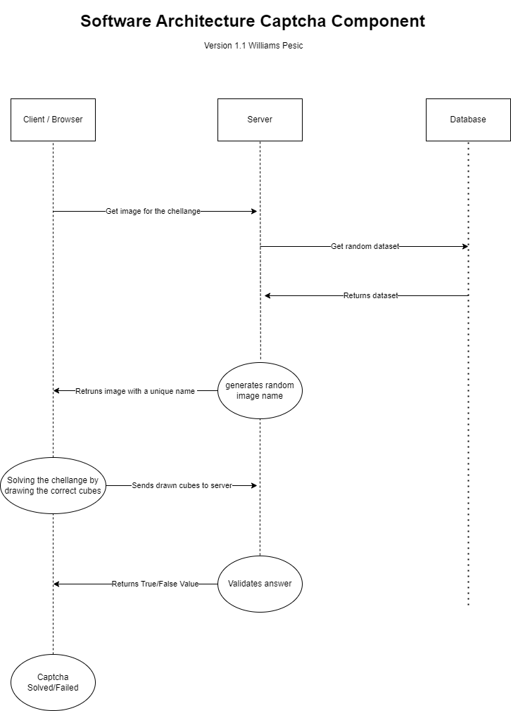

# Customizable CAPTCHA with Image CRUD Integration / Own Backend for dynamical Vaidation (Prototype)

## Description

In the ever-evolving landscape of online security and user verification, the **Customizable CAPTCHA with Image CRUD Integration** is a cutting-edge solution designed to enhance both the user experience and website security. This innovative system combines a user-friendly frontend, a robust backend, allowing website administrators to create and manage their own CAPTCHAs with ease.

### Installation
1. First of all copy or clone my repository on your device, install all packages "npm install".
2. To execute all scripts you just have to run the command "npm run start" in the parent folder.

#### Information
- Captcha GUI localhost:4200
- Crud GUI localhost:5000/GUI
- For the database i have used a basic txt file just for educational purposes this file is located in Drawing-Captcha/Backend/src/

### Software Architecture

  

### Key Features

1. **Customizable CAPTCHA:**
   - Users can interact with a dynamic CAPTCHA by drawing specific shapes, patterns, or symbols.
   - CAPTCHA customization options include size, complexity, and difficulty level. (in development)
   - Various drawing tools and colors are available for user engagement. (in development)

2. **Backend Security:**
   - The backend of the system manages CAPTCHA generation and validation.

3. **Frontend Integration:**
   - Offers a smooth and visually appealing user experience.

4. **Image CRUD System:**
   - Images can be categorized and tagged for easy reference and retrieval.

5. **User-Friendly Administration:**
   - Easy-to-use image upload and editing tools.
   - Real-time preview of custom CAPTCHA designs.

6. **Custom Image Support:**
   - Upload and use custom images, such as company logos or branded symbols, for your CAPTCHAs.

### Benefits

- **Enhanced Security:** Advanced CAPTCHA customization and image control reduce the risk of automated attacks, making your website more secure.
- **Improved User Experience:** A user-friendly frontend and the ability to use custom images create a more engaging and seamless verification process.
- **Brand Identity:** Incorporate your own images to maintain brand consistency and reinforce recognition.
- **Easy Administration:** The integrated image CRUD system simplifies image management, saving time and effort for administrators.

I'm developing this prototype as a personal project for Migros Genossenschafts Bund, aiming to learn and take the lead in my own venture. 🚀 Hopefully, you can also benefit from this work-in-progress prototype. Feel free to follow me on my journey with this project! 🌱👨‍💻
